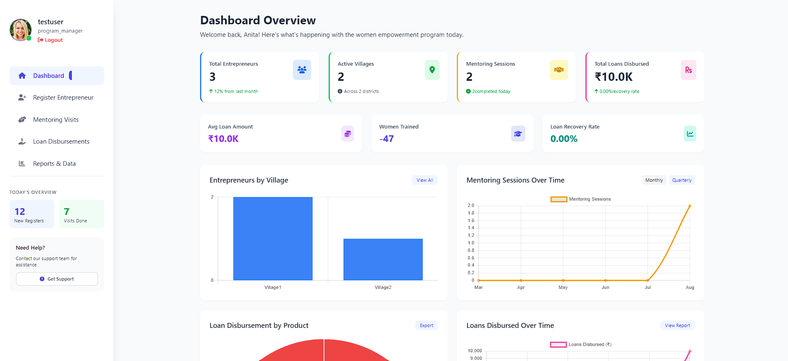
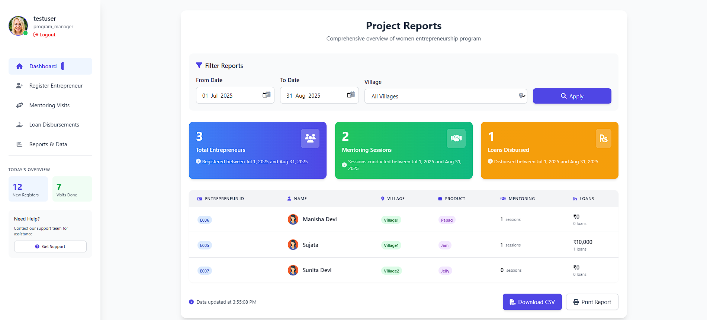
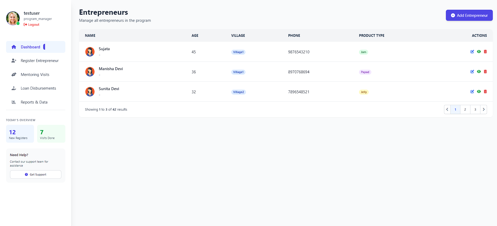
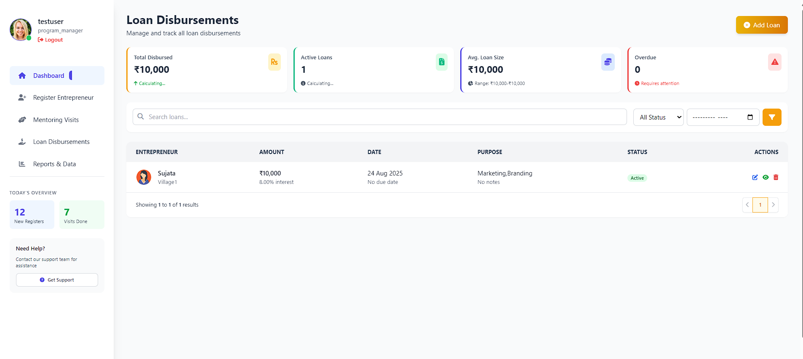

# mission-empowerment-mis

A lightweight, role-based Management Information System (MIS) for empowering women entrepreneurs across rural Assam. Built for easy data entry by field mobilizers and real-time progress tracking by project managers.

Developed using **Node.js**, **MySQL**, **HTML**, **Tailwind CSS**, and **AOS**.

---

## 🚀 Features

- Entrepreneur registration by community mobilizers
- Mentoring visit and loan disbursement tracking
- Filterable reports for project managers
- Role-based access (Mobilizer / Project Manager)
- Export data to CSV/Excel
- Mobile-friendly, fast-loading interface

---

## 🛠 Tech Stack

- **Frontend:** HTML, Tailwind CSS, AOS.js
- **Backend:** Node.js (Core modules, no framework)
- **Database:** MySQL (via XAMPP)

---

## 📦 Installation
1. Clone the repository  
   git clone https://github.com/YOUR-USERNAME/salon-pos-management.git
2. Install [XAMPP](https://www.apachefriends.org/) and start Apache & MySQL.
3. Move the project folder to the `htdocs` directory inside XAMPP:
4. Open a terminal in the project directory and run the server with: ~~ bash nodemon server.js

## 📊 Dashboard Preview

